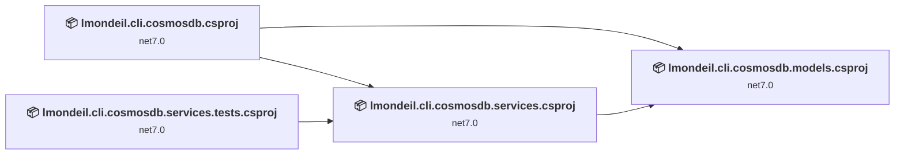
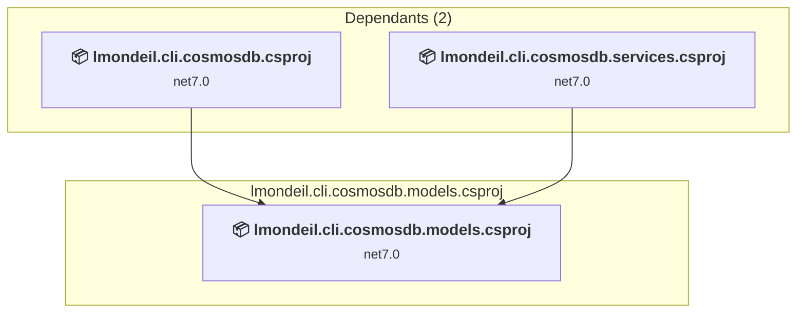
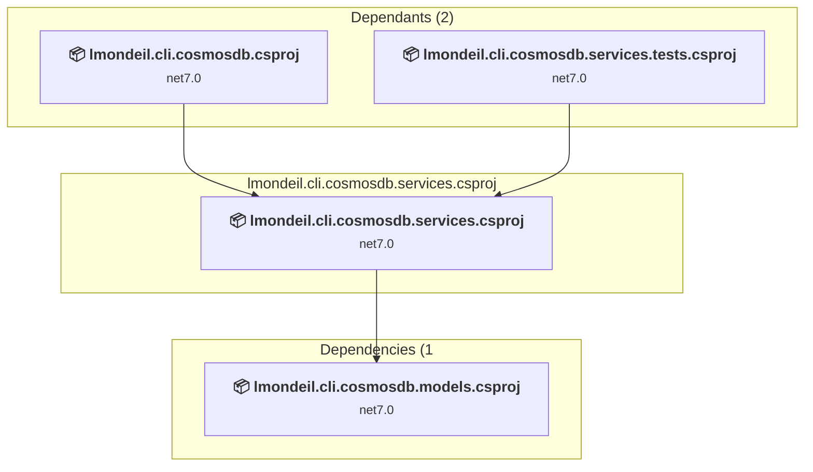
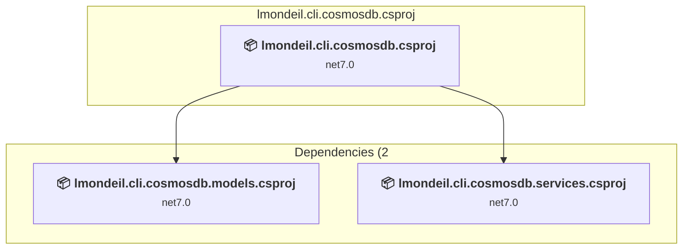
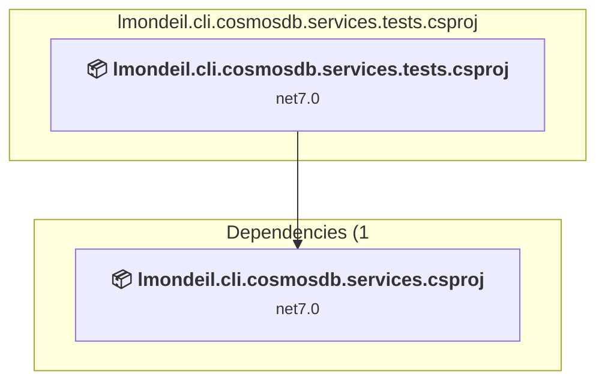

# Projects and dependencies analysis

This document provides a comprehensive overview of the projects and their dependencies in the context of upgrading to .NETCoreApp,Version=v10.0.

## Table of Contents

- [Executive Summary](#executive-Summary)
  - [Highlevel Metrics](#highlevel-metrics)
  - [Projects Compatibility](#projects-compatibility)
  - [Package Compatibility](#package-compatibility)
  - [API Compatibility](#api-compatibility)
- [Aggregate NuGet packages details](#aggregate-nuget-packages-details)
- [Top API Migration Challenges](#top-api-migration-challenges)
  - [Technologies and Features](#technologies-and-features)
  - [Most Frequent API Issues](#most-frequent-api-issues)
- [Projects Relationship Graph](#projects-relationship-graph)
- [Project Details](#project-details)

  - [src\lmondeil.cli.cosmosdb.models\lmondeil.cli.cosmosdb.models.csproj](#srclmondeilclicosmosdbmodelslmondeilclicosmosdbmodelscsproj)
  - [src\lmondeil.cli.cosmosdb.services\lmondeil.cli.cosmosdb.services.csproj](#srclmondeilclicosmosdbserviceslmondeilclicosmosdbservicescsproj)
  - [src\lmondeil.cli.cosmosdb\lmondeil.cli.cosmosdb.csproj](#srclmondeilclicosmosdblmondeilclicosmosdbcsproj)
  - [tests\lmondeil.cli.cosmosdb.services.tests\lmondeil.cli.cosmosdb.services.tests.csproj](#testslmondeilclicosmosdbservicestestslmondeilclicosmosdbservicestestscsproj)

## Executive Summary

### Highlevel Metrics

| Metric | Count | Status |
| :--- | :---: | :--- |
| Total Projects | 4 | All require upgrade |
| Total NuGet Packages | 14 | 5 need upgrade |
| Total Code Files | 32 |  |
| Total Code Files with Incidents | 8 |  |
| Total Lines of Code | 1237 |  |
| Total Number of Issues | 14 |  |
| Estimated LOC to modify | 0+ | at least 0,0% of codebase |

### Projects Compatibility

| Project | Target Framework | Difficulty | Package Issues | API Issues | Est. LOC Impact | Description |
| :--- | :---: | :---: | :---: | :---: | :---: | :--- |
| [src\lmondeil.cli.cosmosdb.models\lmondeil.cli.cosmosdb.models.csproj](#srclmondeilclicosmosdbmodelslmondeilclicosmosdbmodelscsproj) | net7.0 | 🟢 Low | 3 | 0 |  | ClassLibrary, Sdk Style = True |
| [src\lmondeil.cli.cosmosdb.services\lmondeil.cli.cosmosdb.services.csproj](#srclmondeilclicosmosdbserviceslmondeilclicosmosdbservicescsproj) | net7.0 | 🟢 Low | 2 | 0 |  | ClassLibrary, Sdk Style = True |
| [src\lmondeil.cli.cosmosdb\lmondeil.cli.cosmosdb.csproj](#srclmondeilclicosmosdblmondeilclicosmosdbcsproj) | net7.0 | 🟢 Low | 4 | 0 |  | DotNetCoreApp, Sdk Style = True |
| [tests\lmondeil.cli.cosmosdb.services.tests\lmondeil.cli.cosmosdb.services.tests.csproj](#testslmondeilclicosmosdbservicestestslmondeilclicosmosdbservicestestscsproj) | net7.0 | 🟢 Low | 1 | 0 |  | ClassLibrary, Sdk Style = True |

### Package Compatibility

| Status | Count | Percentage |
| :--- | :---: | :---: |
| ✅ Compatible | 9 | 64,3% |
| ⚠️ Incompatible | 1 | 7,1% |
| 🔄 Upgrade Recommended | 4 | 28,6% |
| ***Total NuGet Packages*** | ***14*** | ***100%*** |

### API Compatibility

| Category | Count | Impact |
| :--- | :---: | :--- |
| 🔴 Binary Incompatible | 0 | High - Require code changes |
| 🟡 Source Incompatible | 0 | Medium - Needs re-compilation and potential conflicting API error fixing |
| 🔵 Behavioral change | 0 | Low - Behavioral changes that may require testing at runtime |
| ✅ Compatible | 759 |  |
| ***Total APIs Analyzed*** | ***759*** |  |

## Aggregate NuGet packages details

| Package | Current Version | Suggested Version | Projects | Description |
| :--- | :---: | :---: | :--- | :--- |
| coverlet.collector | 6.0.0 |  | [lmondeil.cli.cosmosdb.services.tests.csproj](#testslmondeilclicosmosdbservicestestslmondeilclicosmosdbservicestestscsproj) | ✅Compatible |
| FluentAssertions | 6.12.0 |  | [lmondeil.cli.cosmosdb.services.tests.csproj](#testslmondeilclicosmosdbservicestestslmondeilclicosmosdbservicestestscsproj) | ✅Compatible |
| McMaster.Extensions.Hosting.CommandLine | 4.0.2 |  | [lmondeil.cli.cosmosdb.csproj](#srclmondeilclicosmosdblmondeilclicosmosdbcsproj) | ✅Compatible |
| Microsoft.Azure.Cosmos | 3.33.0 |  | [lmondeil.cli.cosmosdb.services.csproj](#srclmondeilclicosmosdbserviceslmondeilclicosmosdbservicescsproj) | ✅Compatible |
| Microsoft.Extensions.Hosting | 7.0.0 | 10.0.5 | [lmondeil.cli.cosmosdb.csproj](#srclmondeilclicosmosdblmondeilclicosmosdbcsproj) | NuGet package upgrade is recommended |
| Microsoft.Extensions.Http | 7.0.0 | 10.0.5 | [lmondeil.cli.cosmosdb.csproj](#srclmondeilclicosmosdblmondeilclicosmosdbcsproj) | NuGet package upgrade is recommended |
| Microsoft.Extensions.Logging.Abstractions | 7.0.0 | 10.0.5 | [lmondeil.cli.cosmosdb.services.csproj](#srclmondeilclicosmosdbserviceslmondeilclicosmosdbservicescsproj) | NuGet package upgrade is recommended |
| Microsoft.NET.Test.Sdk | 17.7.2 |  | [lmondeil.cli.cosmosdb.services.tests.csproj](#testslmondeilclicosmosdbservicestestslmondeilclicosmosdbservicestestscsproj) | ✅Compatible |
| MSTest.TestAdapter | 3.1.1 |  | [lmondeil.cli.cosmosdb.services.tests.csproj](#testslmondeilclicosmosdbservicestestslmondeilclicosmosdbservicestestscsproj) | ✅Compatible |
| MSTest.TestFramework | 3.1.1 |  | [lmondeil.cli.cosmosdb.services.tests.csproj](#testslmondeilclicosmosdbservicestestslmondeilclicosmosdbservicestestscsproj) | ✅Compatible |
| Newtonsoft.Json | 10.0.3 | 13.0.4 | [lmondeil.cli.cosmosdb.models.csproj](#srclmondeilclicosmosdbmodelslmondeilclicosmosdbmodelscsproj) | NuGet package upgrade is recommended |
| Serilog.Extensions.Hosting | 5.0.1 |  | [lmondeil.cli.cosmosdb.csproj](#srclmondeilclicosmosdblmondeilclicosmosdbcsproj) | ✅Compatible |
| Serilog.Sinks.ColoredConsole | 3.0.1 |  | [lmondeil.cli.cosmosdb.csproj](#srclmondeilclicosmosdblmondeilclicosmosdbcsproj) | ⚠️NuGet package is deprecated |
| Serilog.Sinks.File | 5.0.0 |  | [lmondeil.cli.cosmosdb.csproj](#srclmondeilclicosmosdblmondeilclicosmosdbcsproj) | ✅Compatible |

## Top API Migration Challenges

### Technologies and Features

| Technology | Issues | Percentage | Migration Path |
| :--- | :---: | :---: | :--- |

### Most Frequent API Issues

| API | Count | Percentage | Category |
| :--- | :---: | :---: | :--- |

## Projects Relationship Graph

Legend:
📦 SDK-style project
⚙️ Classic project

## Project Details

### src\lmondeil.cli.cosmosdb.models\lmondeil.cli.cosmosdb.models.csproj

#### Project Info

- **Current Target Framework:** net7.0
- **Proposed Target Framework:** net10.0
- **SDK-style**: True
- **Project Kind:** ClassLibrary
- **Dependencies**: 0
- **Dependants**: 2
- **Number of Files**: 3
- **Number of Files with Incidents**: 2
- **Lines of Code**: 59
- **Estimated LOC to modify**: 0+ (at least 0,0% of the project)

#### Dependency Graph

Legend:
📦 SDK-style project
⚙️ Classic project

### API Compatibility

| Category | Count | Impact |
| :--- | :---: | :--- |
| 🔴 Binary Incompatible | 0 | High - Require code changes |
| 🟡 Source Incompatible | 0 | Medium - Needs re-compilation and potential conflicting API error fixing |
| 🔵 Behavioral change | 0 | Low - Behavioral changes that may require testing at runtime |
| ✅ Compatible | 0 |  |
| ***Total APIs Analyzed*** | ***0*** |  |

### src\lmondeil.cli.cosmosdb.services\lmondeil.cli.cosmosdb.services.csproj

#### Project Info

- **Current Target Framework:** net7.0
- **Proposed Target Framework:** net10.0
- **SDK-style**: True
- **Project Kind:** ClassLibrary
- **Dependencies**: 1
- **Dependants**: 2
- **Number of Files**: 6
- **Number of Files with Incidents**: 2
- **Lines of Code**: 308
- **Estimated LOC to modify**: 0+ (at least 0,0% of the project)

#### Dependency Graph

Legend:
📦 SDK-style project
⚙️ Classic project

### API Compatibility

| Category | Count | Impact |
| :--- | :---: | :--- |
| 🔴 Binary Incompatible | 0 | High - Require code changes |
| 🟡 Source Incompatible | 0 | Medium - Needs re-compilation and potential conflicting API error fixing |
| 🔵 Behavioral change | 0 | Low - Behavioral changes that may require testing at runtime |
| ✅ Compatible | 96 |  |
| ***Total APIs Analyzed*** | ***96*** |  |

### src\lmondeil.cli.cosmosdb\lmondeil.cli.cosmosdb.csproj

#### Project Info

- **Current Target Framework:** net7.0
- **Proposed Target Framework:** net10.0
- **SDK-style**: True
- **Project Kind:** DotNetCoreApp
- **Dependencies**: 2
- **Dependants**: 0
- **Number of Files**: 22
- **Number of Files with Incidents**: 2
- **Lines of Code**: 830
- **Estimated LOC to modify**: 0+ (at least 0,0% of the project)

#### Dependency Graph

Legend:
📦 SDK-style project
⚙️ Classic project

### API Compatibility

| Category | Count | Impact |
| :--- | :---: | :--- |
| 🔴 Binary Incompatible | 0 | High - Require code changes |
| 🟡 Source Incompatible | 0 | Medium - Needs re-compilation and potential conflicting API error fixing |
| 🔵 Behavioral change | 0 | Low - Behavioral changes that may require testing at runtime |
| ✅ Compatible | 662 |  |
| ***Total APIs Analyzed*** | ***662*** |  |

### tests\lmondeil.cli.cosmosdb.services.tests\lmondeil.cli.cosmosdb.services.tests.csproj

#### Project Info

- **Current Target Framework:** net7.0
- **Proposed Target Framework:** net10.0
- **SDK-style**: True
- **Project Kind:** ClassLibrary
- **Dependencies**: 1
- **Dependants**: 0
- **Number of Files**: 1
- **Number of Files with Incidents**: 2
- **Lines of Code**: 40
- **Estimated LOC to modify**: 0+ (at least 0,0% of the project)

#### Dependency Graph

Legend:
📦 SDK-style project
⚙️ Classic project

### API Compatibility

| Category | Count | Impact |
| :--- | :---: | :--- |
| 🔴 Binary Incompatible | 0 | High - Require code changes |
| 🟡 Source Incompatible | 0 | Medium - Needs re-compilation and potential conflicting API error fixing |
| 🔵 Behavioral change | 0 | Low - Behavioral changes that may require testing at runtime |
| ✅ Compatible | 1 |  |
| ***Total APIs Analyzed*** | ***1*** |  |

